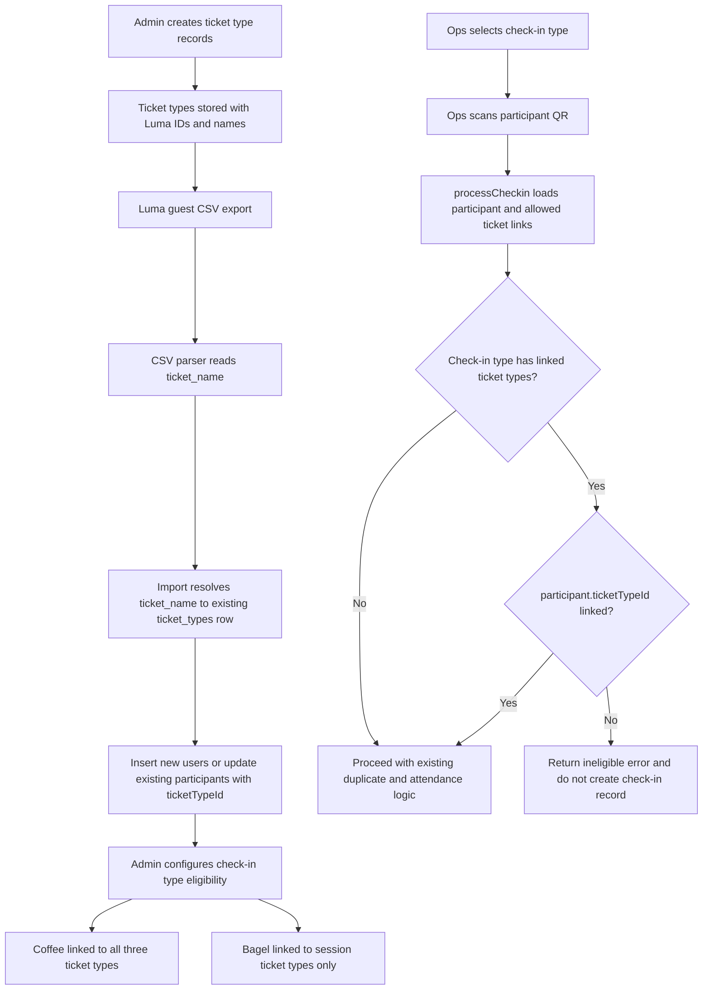

# Ticket-Type-Aware Check-in Eligibility Plan

## 1. Feature Overview

Add first-class ticket types to the platform so guest imports, check-in eligibility, and food entitlement rules all reference the same source of truth.

Target behavior for Cafe Cursor KL:

- Session A ticket: eligible for free coffee and free bagel
- Session B ticket: eligible for free coffee and free bagel
- Drop-in ticket: eligible for free coffee only

The design should support this operational order:

1. Create ticket types first
2. Import guests and attach each participant to a ticket type
3. Configure which check-in types are allowed for which ticket types
4. Let ops enforce the rule at scan time

Key constraints from the current codebase:

- `users` currently stores `lumaId`, but no ticket type reference
- `checkin_types` currently stores only category metadata (`attendance` or `meal`)
- `processCheckin()` currently validates only existence, activity, duplicate status, and attendance/code-assignment logic
- participant import currently skips duplicate emails, so already-imported guests cannot be backfilled with ticket metadata

Implementation goal:

- create a normalized `ticket_types` table
- link each participant to a `ticketTypeId`
- link each check-in type to allowed ticket types through a join table
- update guest import to resolve rows against pre-created ticket types
- keep existing attendance and code-assignment behavior intact

### Known ticket types for this event

| Internal code | Luma ticket type ID | Luma ticket name |
|---------------|---------------------|------------------|
| `drop_in` | `evtticktyp-DERGQKAWQ5LpsQ6` | `Drop in 10am - 3pm` |
| `session_a` | `evtticktyp-HKZPsmnmatNRHFB` | `1000am to 1230pm` |
| `session_b` | pending exact ID | `1230pm to 0300pm` |

The third Luma ticket type ID should be captured before seeding or creating the final `session_b` record.

## 2. Architecture and Flow

### Proposed design

Use a normalized lookup model instead of storing free-form ticket strings on participants or check-in types.

Entities:

- `ticket_types`: one row per Luma ticket type used by the event
- `users.ticketTypeId`: nullable foreign key to `ticket_types.id`
- `checkin_type_ticket_types`: join table that declares which ticket types can use a given check-in type

Design rationale:

- Luma ticket type IDs are more stable than ticket display names, so they belong in a dedicated table
- participants should reference a ticket type row instead of storing raw labels
- check-in eligibility is many-to-many and fits naturally as a join table
- this avoids brittle string comparisons and gives the admin UI a clean place to manage ticket mappings first

Recommended semantics:

- `ticket_types` must exist before guest import
- guest import resolves `ticket_name` from CSV to an existing `ticket_types` row
- `users.ticketTypeId = null` is allowed only for legacy rows or manually created non-participant users
- a check-in type with no linked ticket types remains unrestricted for backward compatibility
- for this event, `Coffee` and `Bagel` should be explicitly linked to ticket types rather than relying on unrestricted behavior

### Recommended event configuration

- `Coffee` check-in type: link to `session_a`, `session_b`, and `drop_in`
- `Bagel` check-in type: link to `session_a` and `session_b` only

Do not hardcode coffee and bagel logic into the ops scanner UI. Ops should continue selecting generic check-in types, while the server checks whether the participant's `ticketTypeId` is linked to the selected type.

### Flow diagram

## 3. Data and API Contracts

### Ticket type model

Add a new `ticket_types` table for event ticket definitions.

Recommended fields:

| Field | Purpose |
|-------|---------|
| `id` | Internal primary key used by app relations |
| `code` | Stable internal code such as `session_a`, `session_b`, `drop_in` |
| `name` | Human-readable label shown in admin UI and matched from Luma CSV |
| `lumaTicketTypeId` | Unique Luma ticket type identifier such as `evtticktyp-...` |
| `isActive` | Allows disabling without deleting |
| timestamps | Standard created/updated tracking |

Notes:

- `code` is useful for internal reporting and stable references
- `name` should match the Luma export label exactly enough for import resolution
- `lumaTicketTypeId` is the canonical external identifier even if the current import source only gives `ticket_name`

### Participant model

Add nullable `ticketTypeId` to `users`.

Recommended semantics:

- required for imported participant rows once ticket types are configured
- nullable for manually created admin, ops, and VIP rows
- nullable temporarily for legacy participant rows until backfill import is run

### Check-in eligibility model

Add a `checkin_type_ticket_types` join table.

Recommended fields:

| Field | Purpose |
|-------|---------|
| `checkinTypeId` | FK to `checkin_types.id` |
| `ticketTypeId` | FK to `ticket_types.id` |
| unique pair | prevents duplicate links |

Recommended semantics:

- zero linked ticket types means unrestricted
- one or more links means only those ticket types may complete the check-in
- existing `attendance` vs `meal` category remains unchanged
- the join table should be managed through the existing check-in type admin workflow

### Guest import contract

Ticket types are pre-created; import should resolve against them instead of inventing ticket data on the fly.

Current known import column:

- `ticket_name`

Optional future-friendly column support if Luma export later includes it:

- `ticket_type_id`
- `ticket_type`

Resolution order:

1. If the CSV includes a Luma ticket type ID, match that against `ticket_types.lumaTicketTypeId`
2. Otherwise match `ticket_name` against the pre-created `ticket_types.name`

If no matching ticket type row exists, treat the row as invalid and return a clear skip reason instead of guessing.

### Import result contract

The current participant import only returns `imported` and `skipped`. For this feature, update it to distinguish:

- `inserted`
- `updated`
- `skipped`

Why this matters:

- existing participants need ticket backfill without duplicate rows
- admins need to see whether re-import synchronized existing data or created new participants

### Check-in response contract

Extend `processCheckin()` to return a distinct ineligible result when:

- the selected check-in type has linked ticket types
- the participant has no `ticketTypeId`
- or the participant's `ticketTypeId` is not linked to that check-in type

The response should provide enough context for the ops UI to show a clear message such as:

- participant name
- selected check-in type
- participant ticket type name if available
- short reason like `This ticket is not eligible for Bagel`

## 4. Relevant Files

| File | Why it matters |
|------|----------------|
| `packages/core/src/auth/schema.ts` | Add `ticketTypeId` to `users` |
| `packages/core/src/business.server/events/schemas/` | Add new schema files for `ticket_types` and `checkin_type_ticket_types` |
| `packages/core/src/business.server/events/schemas/schema.ts` | Export new schema tables and relations |
| `packages/core/src/db/migrations/` | Create migration for new tables, FK column, and indexes |
| `apps/web/src/utils/csv-parser.ts` | Parse `ticket_name` and carry ticket metadata through import |
| `apps/web/src/apis/admin/participants.ts` | Resolve imported rows to `ticketTypeId`, backfill existing participants, expose ticket type in list/edit APIs |
| `apps/web/src/routes/admin/participants.tsx` | Show participant ticket type and allow manual correction |
| `apps/web/src/apis/admin/checkins.ts` | Persist and read ticket eligibility links for check-in types |
| `apps/web/src/routes/admin/checkins.tsx` | Configure allowed ticket types per check-in type |
| `apps/web/src/apis/ops/checkin.ts` | Enforce ticket eligibility during scan processing |
| `apps/web/src/apis/ops/checkin-types.ts` | Return eligibility-related metadata for ops UI if needed |
| `apps/web/src/routes/ops/index.tsx` | Surface clearer ineligible scan feedback |
| `apps/web/src/apis/admin/ticket-types.ts` | Create/manage ticket type records before import |
| `apps/web/src/routes/admin/ticket-types.tsx` | Admin UI to create and review ticket types before importing guests |

## 5. Task Breakdown

### Phase 1: Ticket type foundation

#### Task 1.1: Create `ticket_types` schema

Target files:

- `packages/core/src/business.server/events/schemas/`
- `packages/core/src/business.server/events/schemas/schema.ts`
- `packages/core/src/db/migrations/`

Steps:

- create the `ticket_types` table with internal ID, `code`, `name`, `lumaTicketTypeId`, `isActive`, and timestamps
- create indexes and unique constraints for `code` and `lumaTicketTypeId`
- export table types and relations

#### Task 1.2: Link participants to ticket types

Target files:

- `packages/core/src/auth/schema.ts`
- `packages/core/src/db/migrations/`

Steps:

- add nullable `ticketTypeId` to `users`
- add an index on `users.ticketTypeId`
- add the foreign key relation to `ticket_types`

#### Task 1.3: Create check-in eligibility join table

Target files:

- `packages/core/src/business.server/events/schemas/`
- `packages/core/src/business.server/events/schemas/schema.ts`
- `packages/core/src/db/migrations/`

Steps:

- create `checkin_type_ticket_types`
- add FKs to `checkin_types` and `ticket_types`
- add a uniqueness constraint on the pair

Dependency:

- Phase 1 must complete before ticket types can be created in admin or used in import

### Phase 2: Ticket type setup workflow

#### Task 2.1: Add admin ticket type management

Target files:

- `apps/web/src/apis/admin/ticket-types.ts`
- `apps/web/src/routes/admin/ticket-types.tsx`

Steps:

- build a minimal admin CRUD flow for ticket types
- allow creation before guest import
- show `code`, `name`, `lumaTicketTypeId`, and active status
- prevent duplicate `code` or `lumaTicketTypeId`

#### Task 2.2: Create initial event ticket types

Target files:

- admin UI flow, plus optionally a lightweight seed path if desired during rollout

Steps:

- create `drop_in` with `evtticktyp-DERGQKAWQ5LpsQ6`
- create `session_a` with `evtticktyp-HKZPsmnmatNRHFB`
- create `session_b` after confirming the remaining Luma ticket type ID

Dependency:

- Task 2.1 and the Phase 1 schema must be complete first

### Phase 3: Guest import and participant backfill

#### Task 3.1: Parse and carry ticket metadata from CSV

Target files:

- `apps/web/src/utils/csv-parser.ts`

Steps:

- extend the parser to read `ticket_name`
- optionally support a future `ticket_type_id` column without requiring it now
- carry ticket metadata through the parsed row structure
- treat missing or blank ticket metadata as invalid for participant rows

#### Task 3.2: Resolve imported guests to existing ticket types

Target files:

- `apps/web/src/apis/admin/participants.ts`

Steps:

- resolve each participant row against an existing `ticket_types` record
- use Luma ticket type ID when present
- otherwise fall back to exact `ticket_name` matching
- skip rows with no match and return a readable reason

#### Task 3.3: Backfill or update existing participants on re-import

Target files:

- `apps/web/src/apis/admin/participants.ts`

Steps:

- match existing participant rows by normalized email
- update only import-owned fields: `name`, `lumaId`, `ticketTypeId`
- do not reset role, participant type, status, welcome email timestamps, or check-in history
- return `inserted`, `updated`, and `skipped` counts

#### Task 3.4: Add manual participant correction path

Target files:

- `apps/web/src/apis/admin/participants.ts`
- `apps/web/src/routes/admin/participants.tsx`

Steps:

- include ticket type in list and edit payloads
- show ticket type in the participants table
- allow admins to manually correct the linked ticket type for participant rows
- update import result UI copy to explain inserted vs updated rows

Dependency:

- Ticket types must already exist before import runs

### Phase 4: Check-in type eligibility configuration

#### Task 4.1: Persist allowed ticket links for check-in types

Target files:

- `apps/web/src/apis/admin/checkins.ts`

Steps:

- extend check-in type create and update flows to accept linked ticket type IDs
- store those links in `checkin_type_ticket_types`
- return ticket linkage in list responses used by admin and ops

#### Task 4.2: Add admin UI for ticket eligibility

Target files:

- `apps/web/src/routes/admin/checkins.tsx`

Steps:

- add a multi-select or checkbox group for ticket types in the check-in type form
- show a readable summary in the table, such as `All tickets` or specific ticket names
- prefill edit state correctly
- keep check-in category selection (`attendance` or `meal`) unchanged

Recommended event setup after this phase:

- `Coffee` linked to `drop_in`, `session_a`, and `session_b`
- `Bagel` linked to `session_a` and `session_b`

### Phase 5: Ops-side eligibility enforcement

#### Task 5.1: Enforce ticket links in `processCheckin()`

Target files:

- `apps/web/src/apis/ops/checkin.ts`

Steps:

- load the participant's linked ticket type
- load or query the selected check-in type's allowed ticket types
- if the selected type has linked ticket types and the participant is missing or outside that set, return an ineligible result
- do not create a `checkin_record` for ineligible scans
- leave duplicate prevention and attendance code-assignment behavior unchanged

#### Task 5.2: Improve ops feedback

Target files:

- `apps/web/src/routes/ops/index.tsx`
- `apps/web/src/apis/ops/checkin-types.ts`

Steps:

- distinguish ineligible scans from generic scan errors
- optionally show participant ticket type in the result popup or guest status modal
- optionally show configured ticket eligibility hints in the check-in type selector

Dependency:

- Phases 1 through 4 should land before ops enforcement is enabled in production

### Phase 6: Rollout and operational setup

#### Task 6.1: Create ticket types first

Steps:

- create the three `ticket_types` rows in admin
- verify the exact `session_b` Luma ticket type ID before finalizing setup

#### Task 6.2: Import or re-import guests

Steps:

- export the latest Luma guest CSV
- import it through the updated participant import flow
- confirm `inserted`, `updated`, and `skipped` counts look correct
- spot-check guest rows in admin participants UI

#### Task 6.3: Configure entitlement check-ins

Steps:

- ensure `Coffee` and `Bagel` check-in types exist
- link `Bagel` only to session ticket types
- link `Coffee` to all three event ticket types
- brief ops volunteers on the new ineligible message for drop-in bagel scans

## 6. Risks and Edge Cases

- The exact `session_b` Luma ticket type ID is still missing. Ticket setup should not be considered complete until it is captured.
- If the CSV only includes `ticket_name`, import depends on exact name matching against the pre-created `ticket_types` row. Renamed labels can cause skips.
- Existing imported users will have `ticketTypeId = null` until a backfill import runs. Restricted scans should fail safely with a clear message rather than silently allowing access.
- Luma CSV export can contain the same guest more than once in some cases. If the same email appears with conflicting ticket data in one import, skip and flag it for manual review.
- Manually created VIP, ops, or admin users may remain without ticket types. Restricted entitlement check-ins should not accidentally allow them.
- Admins may change ticket links after some check-ins already exist. The new rule should affect future scans only and must not invalidate history.
- This feature must not interfere with attendance-specific code assignment. Coffee and bagel remain regular check-in types, not code-distribution triggers.

## 7. Testing Checklist

- Create the three `ticket_types` rows and verify duplicate codes or duplicate Luma ticket type IDs are rejected.
- Import a Luma CSV containing Session A, Session B, and Drop-in rows; verify each resolves to the correct `ticketTypeId`.
- Re-import already existing participants and confirm rows are updated instead of duplicated.
- Import a row with an unknown `ticket_name` and verify it is skipped with a readable reason.
- View the participants list and confirm ticket type is visible for participant rows.
- Edit a participant manually and confirm ticket type can be corrected.
- Create or update a `Bagel` check-in type and confirm only Session A and Session B are linked.
- Create or update a `Coffee` check-in type and confirm all three ticket types are linked.
- Scan a Drop-in participant for `Coffee` and confirm the check-in succeeds once.
- Scan a Drop-in participant for `Bagel` and confirm the check-in is rejected with no record created.
- Scan Session A and Session B participants for `Bagel` and confirm the check-in succeeds once per type.
- Re-scan any successful coffee or bagel check-in and confirm duplicate prevention still works.
- Run at least one attendance check-in after these changes and confirm the existing status and code-assignment behavior still works as before.

## 8. Implementation Notes

- **Deviations from plan**: `ticket_types` and related IDs use `cuidId` (same as `checkin_types`) rather than `bigSerialId`, matching existing event tables.
- **Contracts**: Import returns `{ inserted, updated, skipped }`. `processCheckin` failures for restricted types set `ineligible: true` with `error` as the human-readable message. Admin `updateCheckinType` only runs a row update when core fields change; ticket links can be updated alone.
- **Follow-up**: Capture real Luma ticket type ID for `session_b` and create the three ticket type rows in admin before production import; configure Coffee/Bagel links per plan section 4.2.
